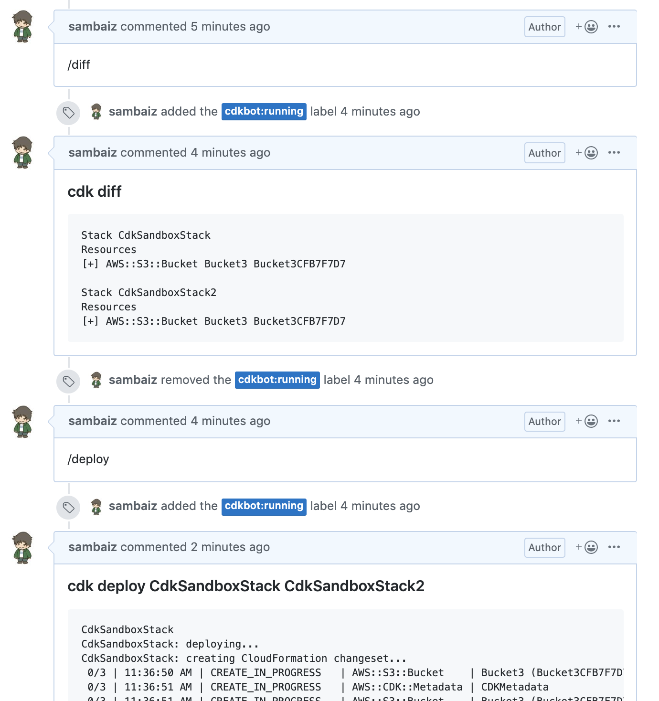

# cdkbot

cdkbot is AWS CDK review & deploy tool working on Pull Request.
Currently only GitHub is supported.

## Commands

Following commands are runnable by PR comments. 
Before running a command, base (where to merge) branch is merged internally 
so it is needed to resolve conflicts if it occurred.

- `/diff`: cdk diff all stacks. Run automatically when open PR and push to PR.
- `/deploy [stack1 stack2 ...]`: 
cdk deploy. If not specify stacks, all stacks are passed. 
After running, PR is merged automatically if there are no differences anymore.

- `/rollback [stack1 stack2 ...]`: 
cdk deploy at base branch. If not specify stacks, all stacks are passed. 
Only deployed PR can be roll backed.



## Label

- `cdkbot:running`: Command is running. 
- `cdkbot:deployed`: 
Added when running /deploy. 
As long as this PR is open for deploying partial stacks etc., no other PR with the same base branch can be deployed.
Running /rollback can remove this.

- `cdkbot:outdated diffs`: 
Added when merging other PR. 
This force to see the latest diffs by running /diff before running /deploy on the PRs with the same base branch.


## Install & Settings

### Install

```
$ make deploy S3Bucket=*** \ 
              SubnetID=subnet-***** \ 
              Platform=github GitHubUserName=*** \ 
              GitHubAccessToken=*** \ 
              GitHubWebhookSecret=***
```

- GitHubUserName & GitHubAccessToken

Token can be generated at `Settings/Developer settings`.
repo and write:discussion scopes are required.

- GitHubWebhookSecret: Generate a random string.
- Platform: Only `github`.
- SubnetID: an exist Subnet ID for running tasks on ECS fargate.


### cdkbot.yml

Put `cdkbot.yml` at the repository root. 
cdkbot refer to the base branch's cdkbot.yml and cdk.json for security and authority reasons 
so it's needed to be merged to apply the changes.

```
cdkRoot: . # Relative path of the directory where cdk.json exists
targets:
  # If any key is matched the PR base branch, run commands with contexts `-c key=value`.
  # If not, commands are not runned.
  develop:
    contexts:
      env: stg
  master:
    contexts:
      env: prd
preCommands:
  # Optional. Run before command.
  - npm run build
deployUsers:
  # Optional. If specified, only these users are allowed to deploy.
  # If not, all users are allowed to deploy.
  - sambaiz
```

### Repository settings

Add a webhook at repository's settings. 

- Payload URL: See CloudFormation Stack output
- Content type: application/json 
- Secret: same value of GitHubWebhookSecret
- Event trigger: Pushes, Issue comments and Pull requests

After the first run, enable "Require status checks to pass before merging" 
in the branch protection rule to prevent merging before deploying (Recommended)

## Why deploys before merging PR?

cdk deploy sometimes fails unexpectedly due to runtime errors of CFn template.
Therefore, if deploys after merging PR, 
broken codes can be merged and surplus PRs are opened to revert or fix, which flagment changes. 
In addition, if there are dependencies between stacks, it is necessary to control the deploy order when deleting resources, 
but to do that, it must specify the execution order beforehand somehow.

Deploying before merging PR has the advantage of resolving these issues but changes may be reverted.
To prevent this, cdkbot takes measures these:

- base branch is merged internally before running a command, and deployed PR is merged automatically
- sets the number of concurrent executions to 1
- `cdkbot:deployed` label to avoid overwriting other PR deploy
- `cdkbot:outdated diffs` label to force to see latest differences